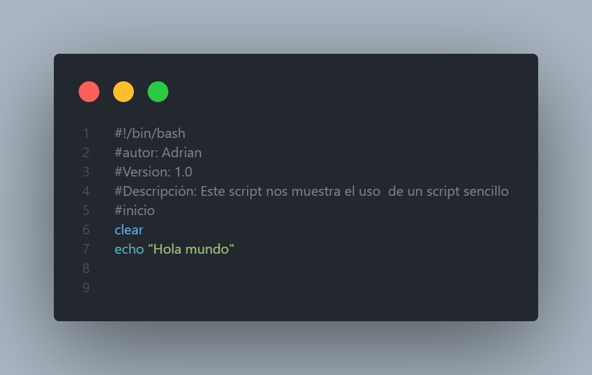
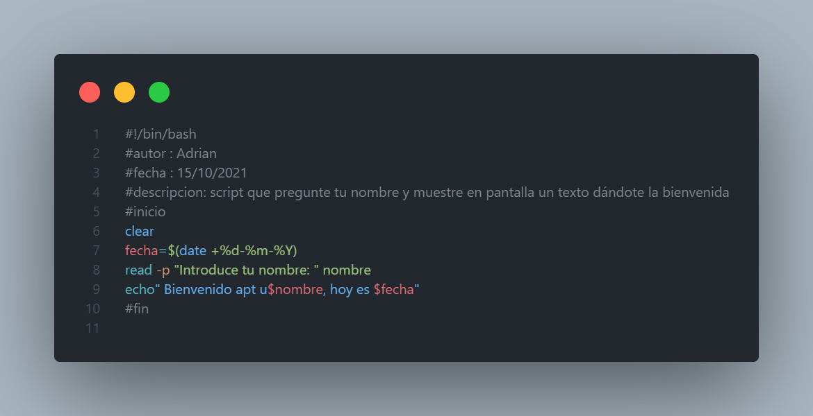

# Scripts-Linux

## ¿Qué son? 
Archivo de texto con una serie de comandos y estructuras organizadas
## ¿Para qué sirven?
Automatizar tareas
## EJECUCIÓN DE SCRIPTS

1. `$ sh script.sh`
2. `$ chmod a+x script.sh` 
3. `$ ./nombre_script.sh`

## ENCABEZADO SCRIPT
````
#!/bin/bash
#Autor
#Versión
#Descripción
#Inicio
````
#### EJEMPLOS 



still building...to be continued


